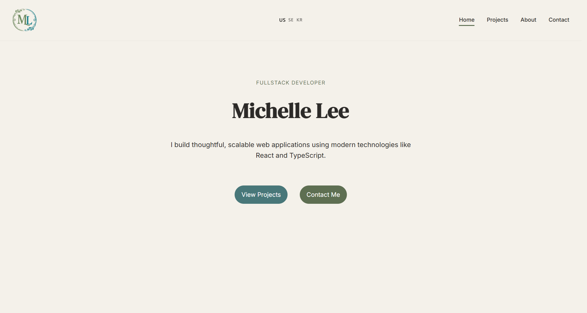
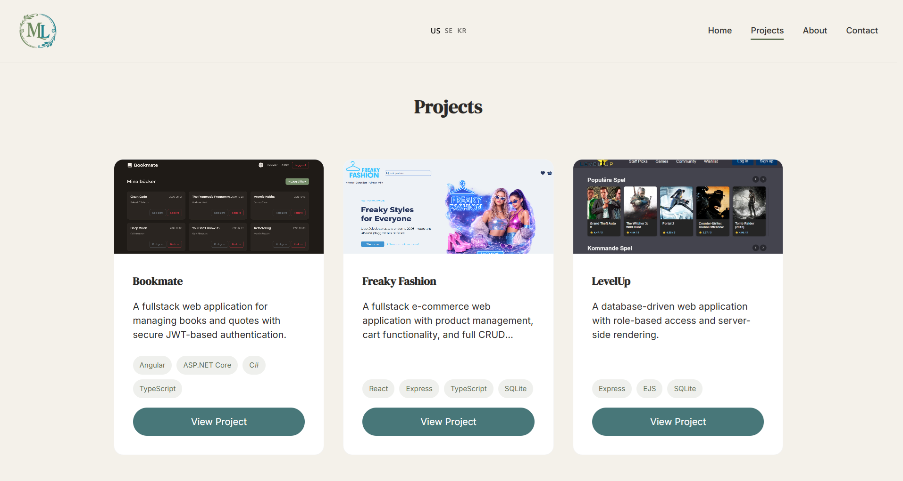
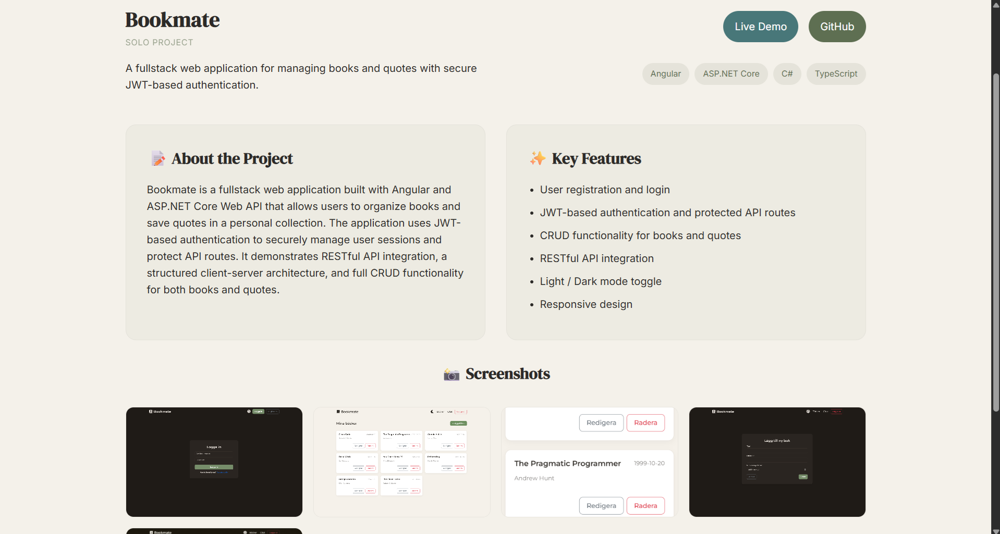

# 🌐 Developer Portfolio

This repository contains my personal developer portfolio built with **React, TypeScript, and Vite**.

The site showcases several fullstack and frontend projects, highlights my technical focus areas, and provides an overview of my background and experience in web development.

The portfolio is fully responsive and supports **multiple languages (English, Swedish, and Korean)**.

---

## 🚀 Live Website

🔗 [Portfolio Link](https://michelle-lee-portfolio.netlify.app/)

---

## ✨ Features

- 🌍 **Multilingual support**
  - English
  - Swedish
  - Korean

- 📂 **Project showcase**
  - Detailed project pages
  - Screenshots and feature breakdowns
  - Live demos and GitHub links

- 📄 **Downloadable CV**
  - Automatically downloads the CV matching the current site language

- 📬 **Contact form**
  - Built with EmailJS for direct messaging

- 📱 **Responsive design**
  - Optimized for desktop, tablet, and mobile

---

## 🖥 Tech Stack

| Frontend | Other Tools |
|--------|--------|
| React | EmailJS |
| TypeScript | i18next |
| Vite | Framer Motion |
| SCSS | React Router |

---

## 📸 Screenshots

### Home Page


### Projects Page


### Project Details


---

## 🛠 Installation

Clone the repository:

```bash
git clone https://github.com/yourusername/portfolio.git
cd portfolio
npm run dev
```
Frontend runs on: http://localhost:5173

## 👩‍💻 Author

[Michelle Lee](https://github.com/ritsumel)